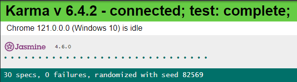

# TVmaze

An Ionic/Angular app to display tv shows.

- [App Store (iOS)](https://apps.apple.com/us/app/tic-tac-toe-puzzle-game/id1611729977)
- [Play Store (Android)](https://play.google.com/store/apps/details?id=dev.flutter.tictactoe)

This game was built using the [`game_template`](https://github.com/flutter/samples/tree/master/game_template)
that you'll find in [github.com/flutter/samples](https://github.com/flutter/samples).

Note: To run the project I used Node v20.10.0. The rest of the versions are in package.json.

## Commands

- `ionic serve`: runs the project
- `npm test`: runs tests

### TASKS

- "You will use an open TV shows API http://www.tvmaze.com/api":

  I have used several APIs provided from TVmaze

- "allows users to view a few lists of TV shows" / "display a few popular TV shows based on their rating and genre":
  By default, a list is shown showing names, rating and genres

- "when the user clicks on a TV show then the details of that TV show should be displayed on another screen":
  Created show-details-page to display all the info (or at least the most important one) related to the show

- "the user should be able to search for a TV show to get the details":
  Created search

- "Application must be responsive and mobile friendly":
  Done

- "We don’t expect you to create things from scratch but, we also would like to see your own creation"
  I didn't use any specific library apart from Swiper for the show gallery. I also created another custom gallery for the cast

- "include unit tests"
  Done

- "check that application is running and there are no console errors"
  Done

- "make sure that the UI is simple yet eye-catching"
  I hope it is :)

- "feel free to include more features other than the few mentioned above"
  Apart from displaying some show details, I also created a component to show the cast, another one to show another gallery for the show images and a third one showing seasons with their episodes.
  Created sort method to order shows by name or rating.
  Also added .apk to test on real mobile.

### EXTRA INFO

The gallery using Swiper one is using a new version for Ionic 7 replacing the previous `ion-slides`. Despite it works fine, when changing the css to display images more center, the arrows are not displayed and swipping is not working. I couldn't fine more info related to this, not sure if this library 100% stable since it seems quite new.

You can try commenting out the code in inmage-gallery.component.scss to see the style fixed (but without the arrows).
