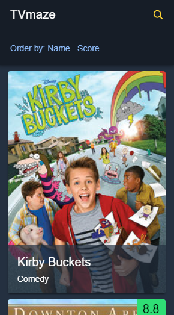
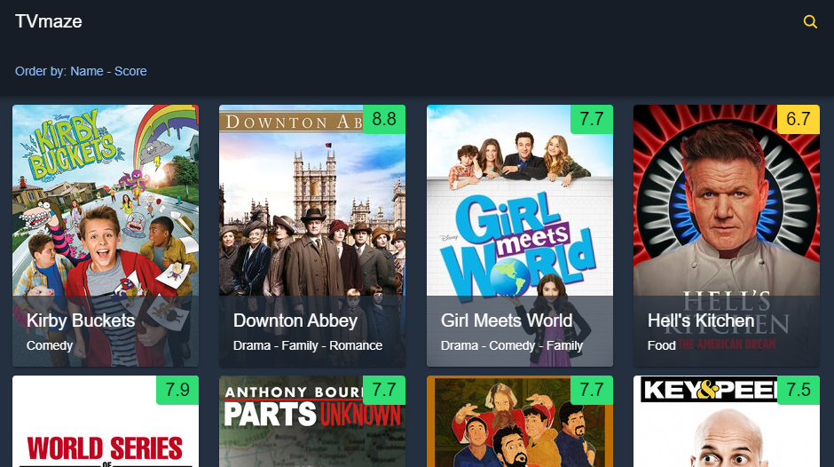
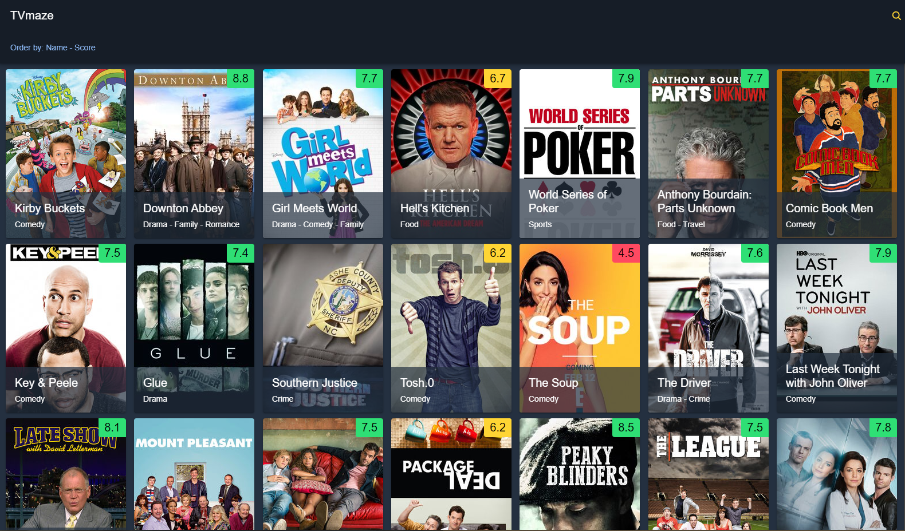
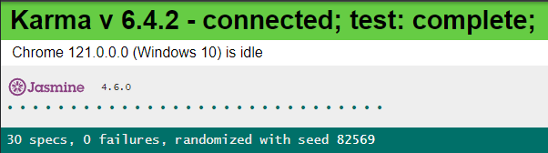

# TVmaze

An Ionic/Angular app to display tv shows.

Note: To run the project I used `Node v20.10.0` and `npm 10.2.3`. The rest of the versions are in package.json.

[CHECK ONLINE](https://tv-maze-dani.netlify.app).

Added `app-debug.apk` to test on real mobile.

## Commands

- `npm install`: installs
- `ionic serve`: runs the project
- `npm test`: runs tests

### IMAGES

Mobile:

Tablet:

Desktop:

